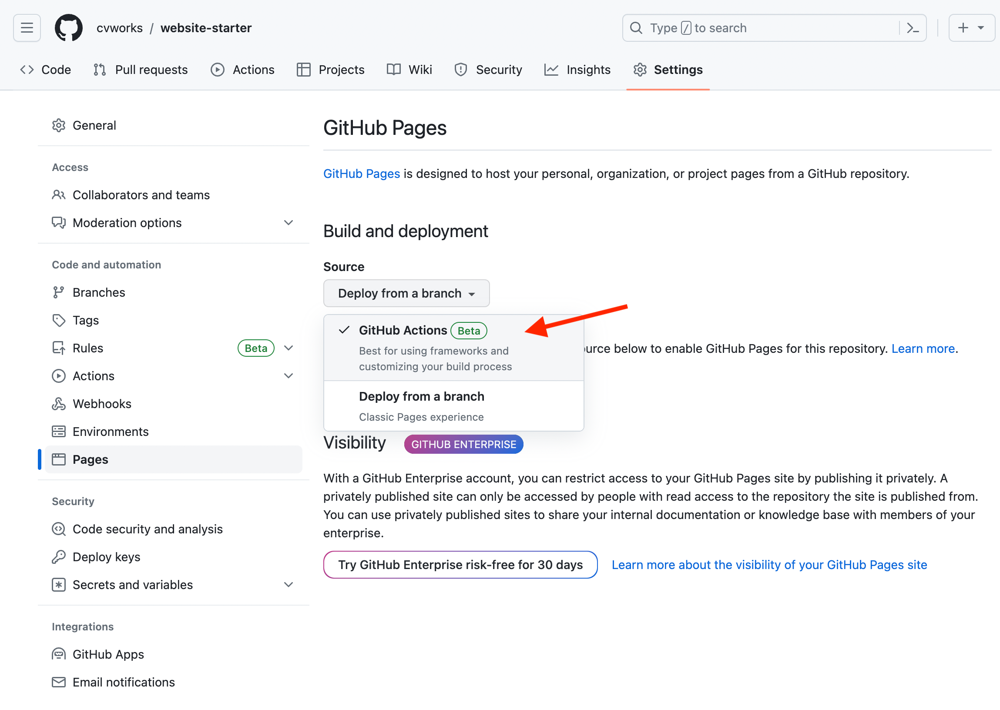

# Build and Deploy with GitHub Actions

1. Go to the `Settings` tab of your [Uniweb modules repository](https://github.com/uniwebcms/website-components-template)

2. Go the the `Pages` tab of the left panel

3. Under the section **Build and deployment**, in the **Source** menue, select `GitHub Actions`. The page auto saves, so that is all.

<kbd>  </kbd>

4. Go to the `Actions` tab of the repository

5. Accept the current workflow by clicking on the green button labelled "I understand my workflows, go ahead an enable them"

<kbd>  </kbd>

That is all. Now, when you commit changes to the `main` branch, the module will be built and deployed at:

```text
https://[gh-account-name].github.io/[repo-name]/[module-name]
```

For example, if your GitHub account name is `cvworks`, the repository name is `uniweb-modules`, and the module name is `SimpleCollection`, 
then the URL `https://cvworks.github.io/uniweb-modules/SimpleCollection` is the value you use to [set the Web Styler of a 
Docufolio in Uniweb](https://github.com/uniwebcms/uniweb-module-builder/blob/main/docs/dev_with_tunnel.md#connecting-the-module-to-a-website).

In addition, if the GitHub Actions are set to build a tutorial website for all the modules in the repo, the site will be deployed at:

```text
https://[gh-account-name].github.io/[repo-name]/tutorial
```

The default GitHub Actions normally also build an `index.html` page at the root level:

```text
https://[gh-account-name].github.io/[repo-name]
```

## Optional: triggering the build and deploy workflow manually

1. Go to the `Actions` tab of the repository

2. Go the the `Build and Deploy` tab of the left panel

3. Open the **Run workflow** menu on the main panel and click on the green button labelled **Run workflow**

<kbd>  </kbd>
