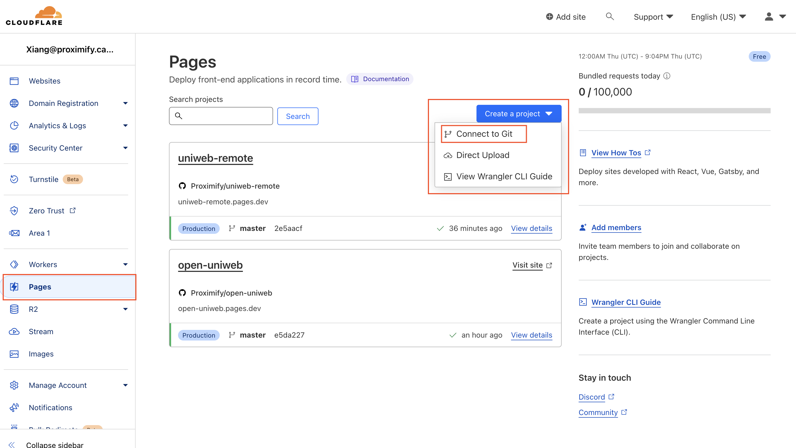
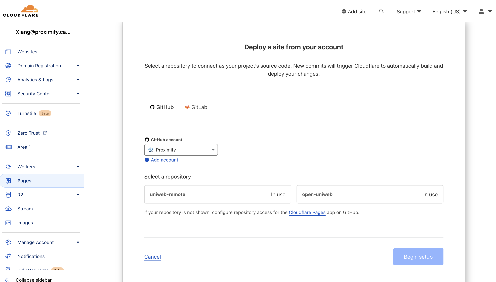
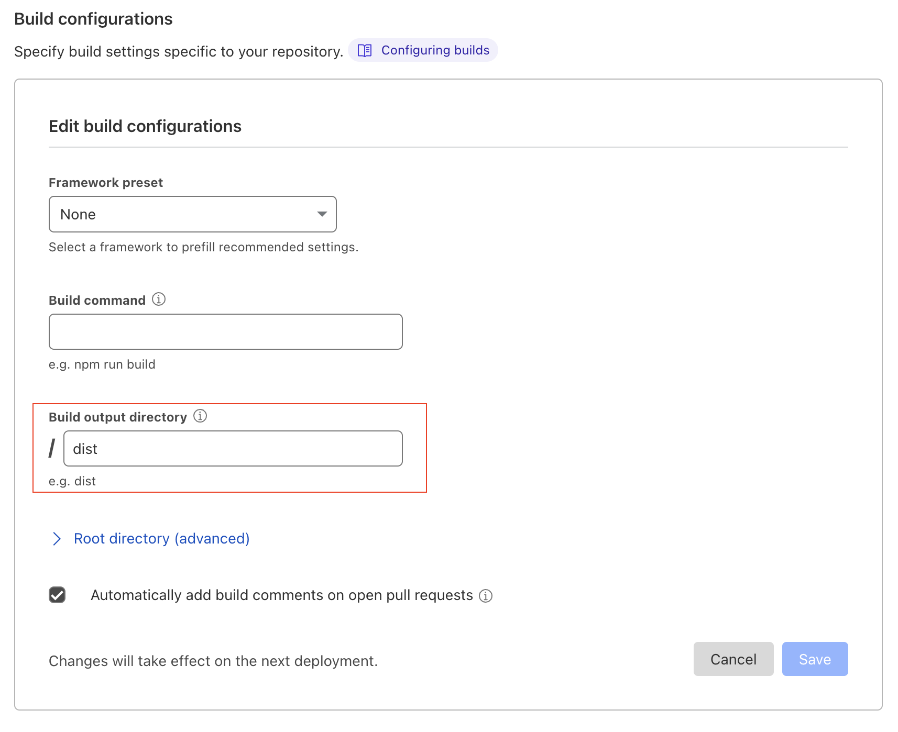
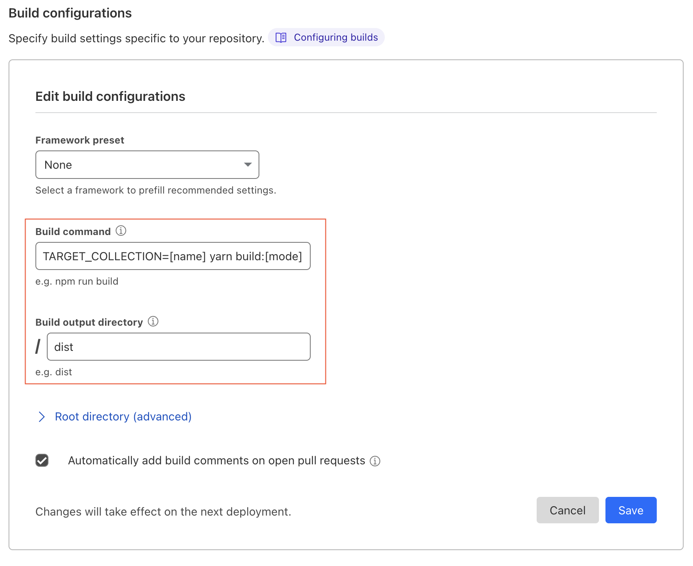
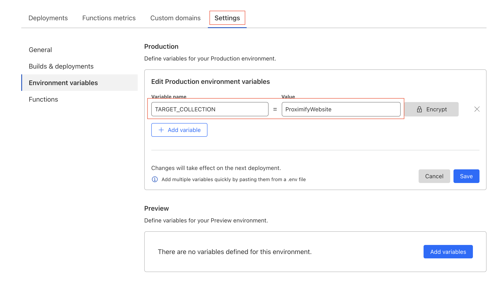
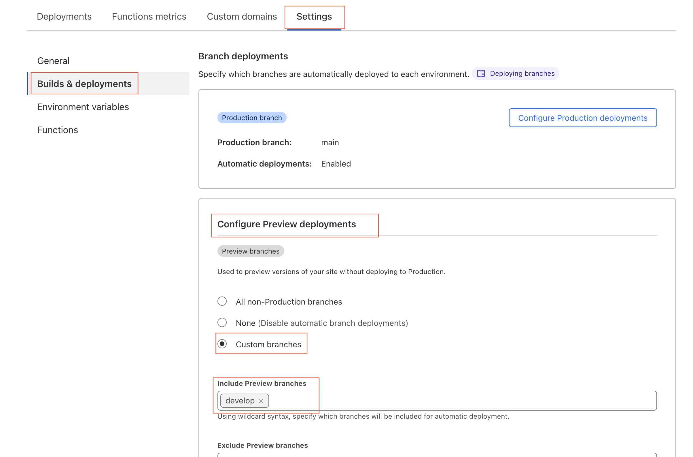
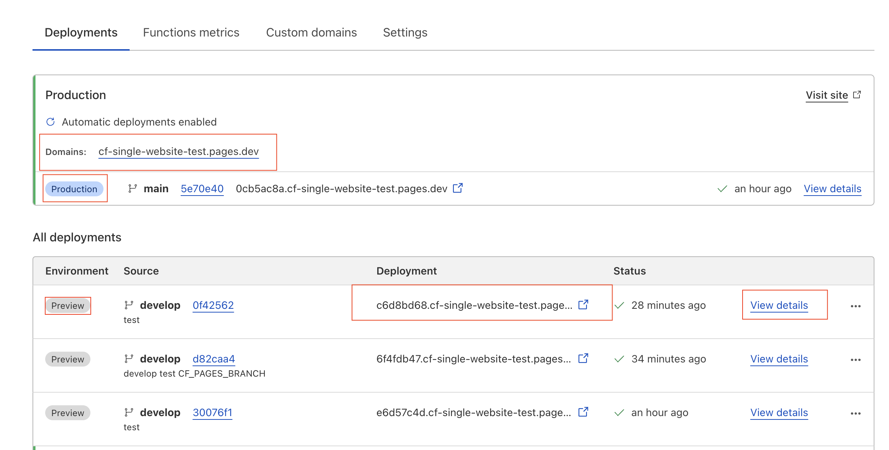

# How to set up [Cloudflare Pages](https://developers.cloudflare.com/pages/)

1. [Create a Cloudflare account](https://dash.cloudflare.com/signup) if you don't have one.
   <br/>

2. Create a new Page project and select Connect to Git
   
   <br/>

3. Select a Github repository with Uniweb Widget Collections
   
   <br/>

4. Configure the optional build command and the output directory as below.

    

## Configuring remote or local build modes

Cloudflare allows users to specify an optional command to builds a distribution from the code. It is executed every time a new commit is detected. In some cases, that is a good approach and in other cases is preferable to build locally and commit the distribution files to the repository.

### Remote build configuration

Cloudflare can build source code using the `build` script. This script can be configured on the Cloudflare Pages project settings and it is static which means more suitable for a repository containing a single Website.

1. Configure the Pages project build settings

    

> Every new commits will trigger Cloudflare to automatically build and deploy your changes using this build command
> This is useful when developer try to release new version without a node environment

The automatic build of Cloudflare can only build one collection per repository. The name of the collection is needed at build time and it's taken from the environment variable `TARGET_MODULE`. The variable can be set in different ways. One method is to set it in Cloudflare's **Environment variables** settings.



### Local build configuration

In this scenario, we use a building script to build different website widgets individually. We build a  bundle locally and then commit it to Git. For that, we just have to tell Cloudflare to skip the Build process.

In Cloudflare:

1.  **Make sure that the Framework and the Build command are blank**.
2. Set the *Build output directory* to be `dist`.

#### Building for Cloudflare

We can now distribute multiple collection per repository. Still, when building a collection, we must build one at a time. The name of the collection is taken from the environment variable `TARGET_MODULE`. One option is to set `TARGET_MODULE` in your `.env.dev` file to the name of target collection. Then, run the script below whenever you want to build and commit that collection.

```bash
# Build and commit
yarn build:prod-commit
```

Or, to build without committing, use `yarn build:prod` instead.

This script creates a bundle of Javascript code. The destination directory is the local dist folder. After the build it's complete, tt commits and push new files to git. Cloudflare will catch the commit and deploy new content.

> The name of the target collection can also be passed by adding it before the script call: `TARGET_MODULE=[name] yarn build:prod`. That will override the name set in any of the `.env` files.

## Production and Preview deployments

######Cloudflare supports both production and [preview](https://developers.cloudflare.com/pages/platform/preview-deployments/) deployments.

A **Cloudflare Pages** production branch can link to the production branch for the GitHub repo and a **Cloudflare Pages** Preview branch can link to a Github repo development branch. Under the development stage, any changes made on develop branch will not affect the website that uses **Cloudflare Pages** production branch.

The `Preview` branch can be enabled by adding the Configure for Preview deployments.



When commit to develop branch, the `Preview` branch provide by **Cloudflare Pages** will be triggered instead of the Production branch. Be aware that the `Domain` for the Production branch and Preview branch are different.



On the "View details" page of the latest "Preview" deployment, the Preview branch `Domain` has an alias. Each commit does not change this alias.

## Auto build mode

When the build mode is not part of a sript name, such as in `yarn build`, the mode is determined from the branch name. When the branch name is **master** or **main**, the build is optimized for production. Otherwise, the build mode is development.

## Custom domains

Cloudflare allow you to have a [custom domain](https://developers.cloudflare.com/pages/platform/custom-domains/) that will always show the latest build for a specific branch on your Pages project.

Also see how to create a [custom branch alias](https://developers.cloudflare.com/pages/how-to/custom-branch-aliases/).
