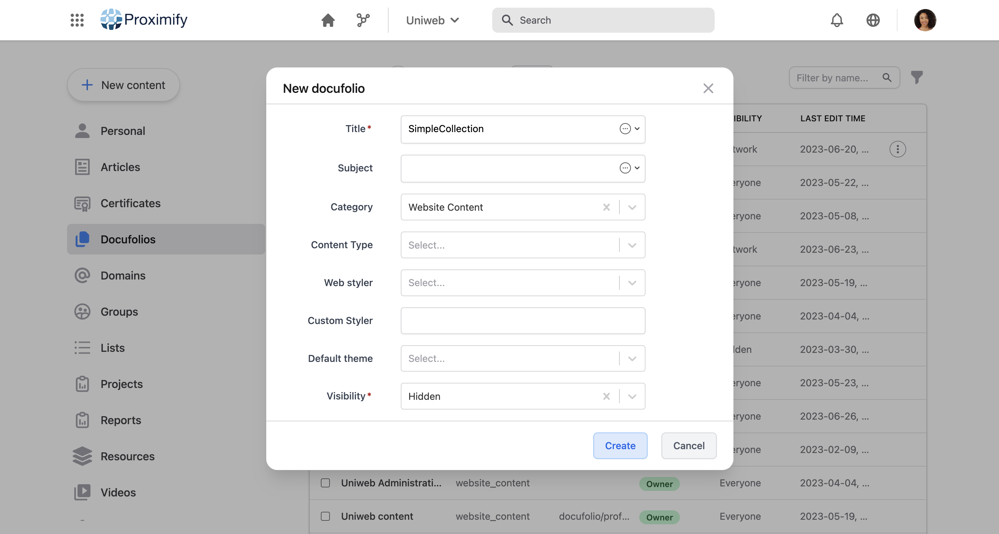
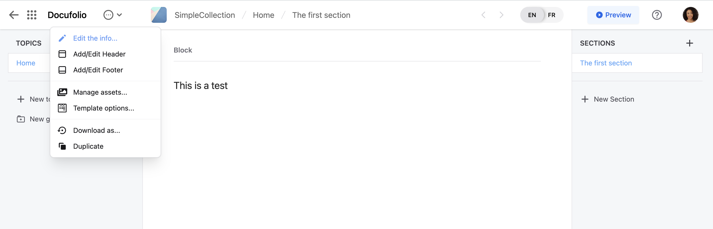
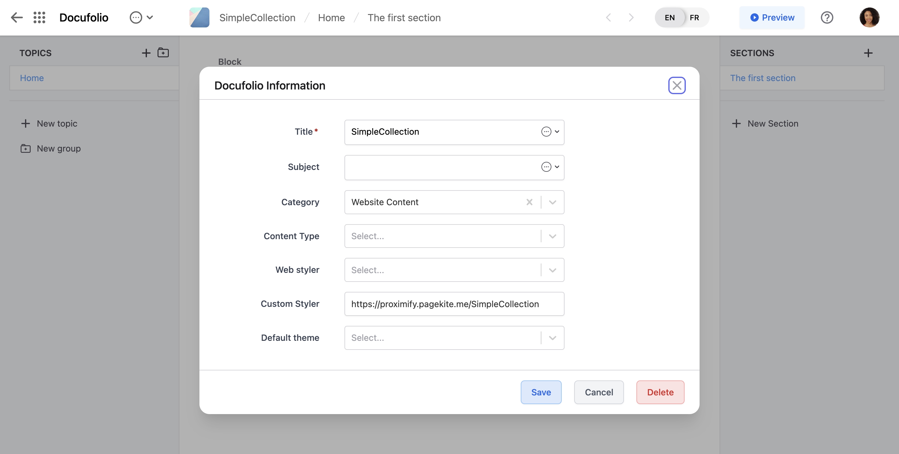
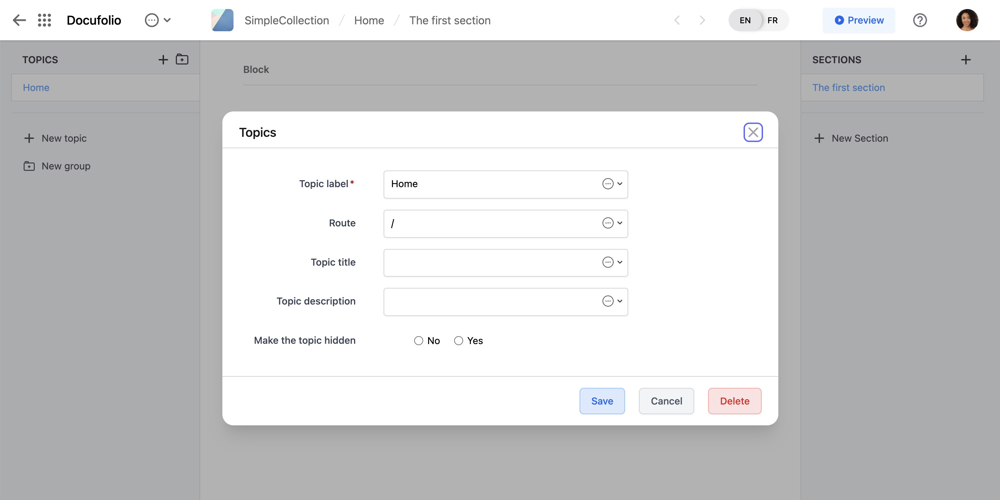
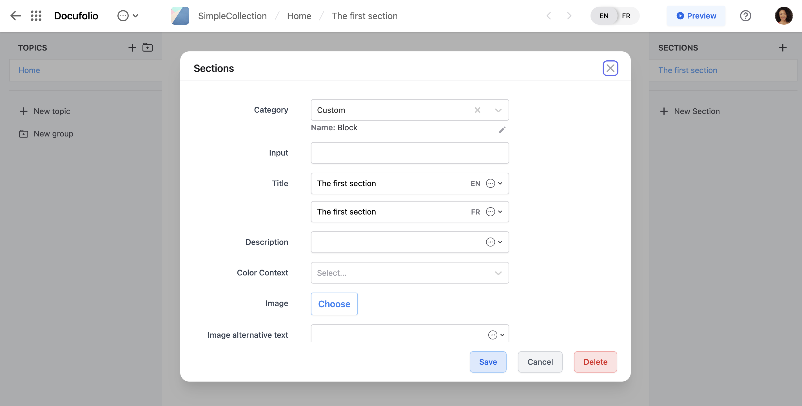
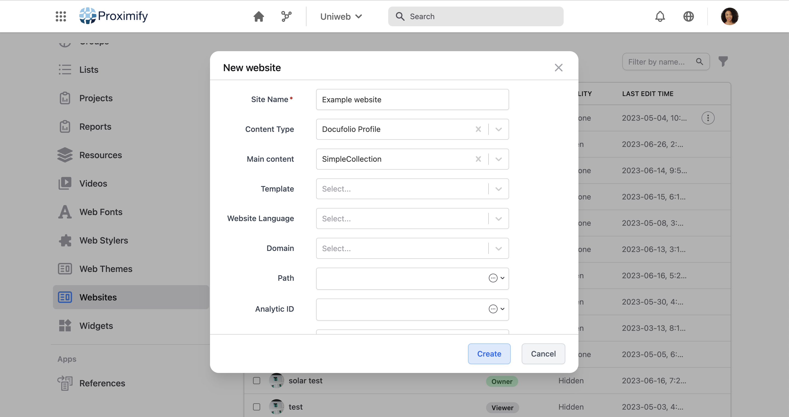
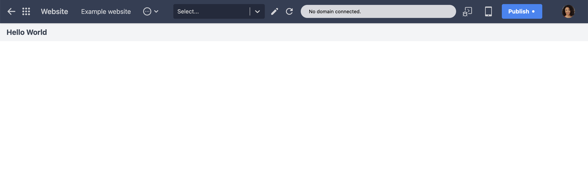
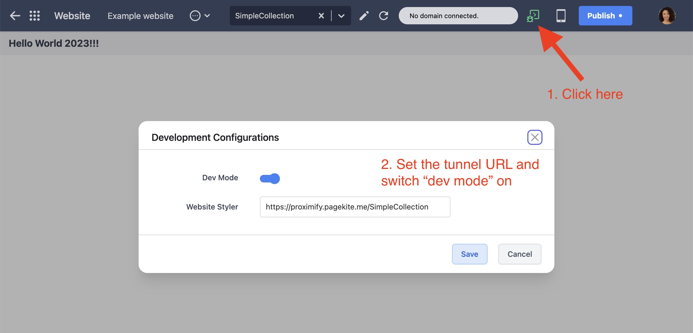

# Serving and fetching a module via a tunnel

Assuming that you installed the [development toolchain](dev_toolchain.md), you should be ready to run a local web server and a public tunnel to it.

You will need 2 terminal windows: one to run the web server and another to watch for code changes and rebuild the distribution bundle.

In one terminal, run

```bash
yarn serve --tunnel
```

You can check that the server is working by visiting `https://127.0.0.1:3005`. In addition, the `build_dev` folder has a `quick-tunnel.txt` file with the URL of the active tunnel. Visit that public URL and confirm that it serves the files in `build_dev`. 

The `--tunnel` option requests the creation of a [Cloudflare quick tunnel](https://developers.cloudflare.com/cloudflare-one/connections/connect-apps/do-more-with-tunnels/trycloudflare/) which provides a different URL every time the web server is started. It is also possible to configure a permanent tunnel URL in the environment variables. In that case, your local `.env.dev` file should set the URL of the `TUNNEL_URL` variable to the URL of the permanent tunnel. For example, you can set up a [permanent tunneel with Pagekite](pagekite.md).

Next, **in another terminal**, run

```bash
yarn watch
```

The output should show the filds that were built and the URL of the collection. For example,

```bash
Dev URL: https://[tunnel-sub-domain].trycloudflare.com/SimpleCollection
```

You will have copy this URL and past in in the "dev mode" options of your website so as to connect the website to your development distribution as discussed below.

## Connecting the module to a website

A module can be linked to a website for production or development purposes.

Here we assume that you have access to a [Uniweb instance](https://help.uniweb.app/uniweb_instance) where you can create a [website](https://help.uniweb.app/website).

Create a [docufolio](https://help.uniweb.app/docufolio) of type _website content_.



The standard module repository includes an example module called `SimpleCollection`. It is a collection with a single component named `Block` whose code is located at `src/SimpleCollection/components/Block.js`. Or goal is to configure one section of the docufolio to request this component.

Edit the properties of the docufolio...



... and set the **Custom Styler** to the URL of the tunnel `https://[tunnel-sub-domain].trycloudflare.com/SimpleCollection`. This is a temporary setting because it should be set to the URL of the production version of the module, but we don't have that yet, so we use the dev URL that we have.



Save the change. Next, in the new docufilio, add a new **Topic** and set its **Topic label** to "Home" and its **Root** field to "/".



We are now ready to configure the docufolio to use components from our module. We do that on a per-section basis using the **Category** property of a section to define which component is to be used to render the contents of the section.

The topic we created above already has one section in it (see the right panel of the docufolio). Edit the section and set its Category to "Custom" and when prompted, set the name field to "Block". That will define that the section has to be rendered by a Block component.



### Create a website

Now that we have a docufolio with some basic contents, we can create a website based on it.

> The docufolio we created is really basic. It only has a single section of category "Custom/Block" and not content. While minimal, that is enough for our example.

Create a new website profile and choose the new docufolio as its content.



The result should be a basic site that showing the text "Hello World".



The text is coming from the `Block.js` code

```javascript
export default (props) => {
    return <p className='text-lg text-gray-700 font-bold px-4 py-2 bg-gray-100'>
        Hello World
    </p>;
};
```

## Updating the module

You are now ready to work on the code of the module and see the results live. For example, lets change the text in `Block.js` so that the components renders the text "Hello World 2023!!!".

Since we have run `yarn watch` earlier, changes to the code should trigger a rebuild of the files under the `dist` folder. To see the effect of the change, can reload the website. If the old text is visible, disable the JavaScript caching on your browser and the reload the site again.

This is also a good moment to configure the "dev mode" of the site. While not strictly necessary now, it is good to know that we can give a temporary URL for our dev tunnel:



This will let us change the docufolio Custom styler to the proper production URL later while still being able to work with a tunnel for development purposes.
