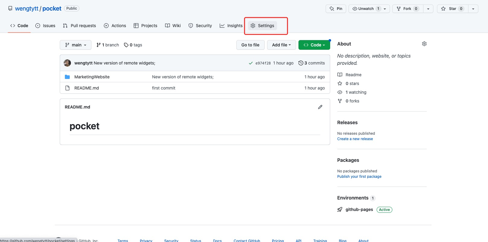
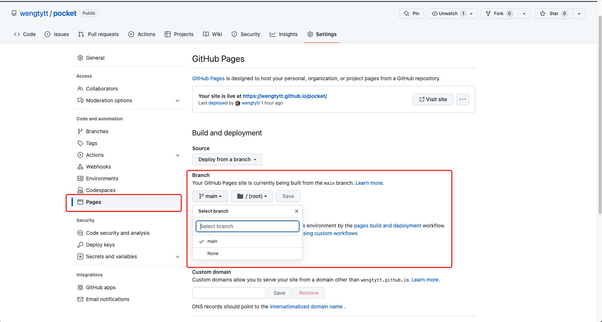

# How to set up Github Pages to host the remote widgets in github repository

1. Click Settings menu in the github repository page



1. Choose the branch from which the site is being built.



> Note: in this case, the environment variable `PUBLIC_URL` would be set to a URL like `https://MY-ACCOUNT-NAME.github.io/PROJECT-NAME` so that the publishing script knows the expected distribution URL.

###### _Integrate with github pages_

```bash
TARGET_COLLECTION=[name] yarn build:prod-copy-commit
```

This script creates a bundle of Javascript code. The destination directory is given by the property `OUTPUT_COPY_DIR` set in the `.env.dev`, which is often a **distribution repo**.
