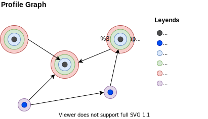

# Profile Relationships



## Terminology

**Entity**: an abstract category with distinct and instantiable existence in some domain of analysis.

**Profile**: A data structure representing attributes of an **entity** by grouping them into items of some type. The **item type** is defined by the **profile section** that contains the item. The properties of the item are defined by its **field values**.

**Schema**: The abstract definition of the **sections** and **fields** that are allowed for a profile.

**Schema view**: is a *profile schema* for an *entity*. One *entity* type can have several distinct schemas defined for it.

**Item**: a concrete instantiation of values for the set of fields that define a profile section or subsection.

**Relationship**: A connection between two profiles. In abstract terms, in represents an edge between two nodes of a graph in which each node is a profile of some type.

**Unidirectional relationship**: A connection between a **source** profile view and a **target** profile view. In abstract terms, in represents an directed edge between a source node and a target node of the same or different type.

**Bidirectional relationship**: Two unidirectional relationships such that one of them causes the other one to exist in the opposite direction. The target profile of one relationship is the source of the other and vice versa.

**Relationship field**: A section field whose schema type is *profile* represents a *relationship field*.

**Relationship section**: A section with at least one *relationship field* is called *relationship section*.

**Info section**: If the first section of a profile schema restricts the number of items allowed in it to just one, the section is considered to be the *info section* of the profile.

**Relationship item**: An item of a **relationship section**.

**Info item**: The single item of an *info section*. It is included as contextual information with the value of a **relationship field**. In that way, the source profile knows some basic info about the target profile in the relationship.

**Profile attributes**: Information captured by a profile instance. Each item of a profile defines attribute values of the profile.

**Relationship attributes**: Attributes that characterize the relationship between two profiles. The relationship attributes can be represented by additional fields in the **relationship section** of the source profile that defines the relationship. Some relationship attributes may not belong to either of the profiles in a relationship but to the relationship itself and saved in terms of **dynamic subfields**.

**Dynamic subfields**: Fields whose schema is not defined in a profile schema but by items of a given type from the target profile in a relationship.

**Dynamic attributes**: Relationship attributes defined in terms of **dynamic subfields**.

## Unidirectional and Bidirectional Relationships

Defining a relationship in a database involves defining primary keys and foreign keys in several tables. Relationships of type one-to-many can store the attributes of the relationship in the table representing the "one" endpoint. For many-to-many relationship, an additional table is needed to get the attributes of each instance of a relationship. Uniweb profiles work in a similar fashion but there is no need to define keys or tables. For example, let's consider the case of a **professor** profile that is connected to **course** profile with the relation "teacher_of" from a professor to a course. The relationship can be unidirectional or bidirectional. If it is bidirectional, there must be a corresponding relationship "taught_by" from a course to a professor.

There is no need to declare whether a relationship is one-to-one, one-to-many or many-to-many. The choice of cardinality is controlled by the number of items that are allowed in the **relationship section**. For example, the *professor profile* may have a section named "Courses Taught" that is allowed to have any number of items in it, each with a **course field** of type `course/profile`. On the other hand, the course profile may have a "Teacher" section limited to one item, which has a field of type `professor/profile`. That schema choice defines a **one-to-many bidirectional relationship** between professors and courses. If instead we want a many-to-many relationship so that a course can be taught by several professors, the **relationship section** could be named "Teachers" instead and be given no limits on the number of items allowed in it.

The profile schema designer is responsible for choosing to define unidirectional or bidirectional relationships. The **relationship attributes** can be defined alongside the relationship field of the relationship section that defines the relationship in the source profile. For example, the specific semester in which a professors teaches a course can be a field in the "Courses Taught" section. 

The following example is a bidirectional relationship between network members and groups.

```json
// Member profile schema
 "Member groups": {
    "label": {"en": "Groups"},
    "fields": {
        "Group": {
            "label": {"en": "Group"},
            "type": "profile",
            "subtype": "groups/profile",
            "notNull": true,
            "constraints": {
                "profileTarget": {
                    "section": "group_members",
                    "field": "member",
                    "needsConsent": true
                }
            }
        }
    }
}

// Group profile schema
"Group Members": {
    "label": {"en": "Members"},
    "fields": {
        "Member": {
            "label": {"en": "Member"},
            "type": "profile",
            "subtype": "members/profile",
            "notNull": true,
            "description": {"en": ""},
            "constraints":{
                "profileTarget":{
                    "needsConsent": true,
                    "section":"member_groups",
                    "field":"group"
                }
            }
        }
    }
}
```

In the example above, each relationship field defines its corresponding field on the target profile. In addition, the `needsConsent` flag tells the system that the owner of the target profile should consent to the automatic creation of a corresponding relationship in the opposite direction since the system must modify the target profile to achieve that.

> Do we have a case in which auto relations don't need consent?

## Dynamic Attributes

In advanced designs, the attributes of a relationship may depend on the particular profiles that are involved. For example, in the case of **workflow** and **task** profiles, each possible choice of task defines its own arguments that must be given values when linking a task with a workflow. In a case like this, the **relationship attributes** cannot be defined in the relationship section of the **workflow** and **task** schemas because they depend on the task type and are likely not even known at schema-definition time. They are **dynamic attributes** defined by the choice of a particular task profile.

The following example shows how to define dynamic attributes as **subfields** of the **relationship field**.

```json
// Workflow profile schema
"Pipeline": {
    "fields": {
        "task": {
            "label": {
                "en": "Task"
            },
            "type": "profile",
            "subtype": "task/profile",
            "constraints": {
                "profileData": {
                    "section": "parameter_definition"
                }
            }
        }
    }
}
```

Here the `profileData` parameter tells the system that the subfields of the *task field* are defined in the section `parameter_definition` of the task profile.

In turn, the task profile schema is defined as follows:

```json
{
    "Task Information": {
        "maxItemCount": 1,
        "fields": {
            "Name": {
                "label": {
                    "en": "Task name"
                },
                "type": "string",
                "maxCharCount": 200,
                "notNull": true
            },
            //...
        }
    },
    "Parameter Definition": {
        "label": {
            "en": "Parameter Definition"
        },
        "fields": {
            "Name": {
                "label": {
                    "en": "Name"
                },
                "type": "string",
                "maxCharCount": 50,
                "notNull": true
            },
            "Label": {
                "type": "string",
                "label": {
                    "en": "Label"
                },
                "notNull": true
            },
            "Description": {
                "label": {
                    "en": "Description"
                },
                "type": "string",
                "maxCharCount": 500
            },
            "Type": {
                "label": {
                    "en": "Type"
                },
                "type": "systable",
                "subtype": "FieldTypes",
                "notNull": true
            },
            "Subtype": {
                "label": {
                    "en": "Subtype"
                },
                "type": "systable",
                "subtype": "FieldSubtypes",
                "constraints": {
                    "filter": {
                        "masterField": {
                            "name": "Type"
                        }
                    }
                }
            },
            "Not Null": {
                "label": {
                    "en": "Not null"
                },
                "type": "boolean"
            },
            "Constraints": {
                "label": {
                    "en": "Constraints"
                },
                "type": "string",
                "constraints": {
                    "json": true
                }
            }
        }
    }
}
```

The subfield values are saved together with their corresponding relationship field value in the source profile.

<!--
You may choose to load fields dynamically not from the profile from another defined schema. in that case designer will need to name the schema section from the source schema file and provide the name of the source profile. 

```
,
                    "Task": {
                        "label": {
                            "en": "Task"
                        },
                        "type": "profile",
                        "subtype": "task/profile",
                        "constraints": {
                            "profileData": {
                                "section": "section_name"
                                source:  "source.json"
                            }
                        }
                    },
```

This Diagram will help the designer for decision making. 


-->

## Learn more

- [Schema design](schemas.md)