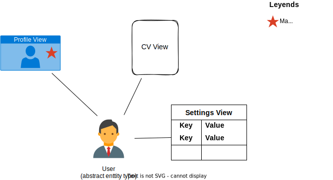
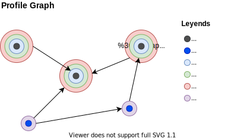

# Profile Schemas

Defining how information is to be organized in a database can be an daunting task. A Uniweb **profile schema** is a concept designed to abstract out the complexities involved in defining a database schema. It is a much-simplified approach to declaring advanced database entities and their relationships.

The approach works as follows. Abstract entities can have one or more **profile schema views** linked to them. One schema view per entity is selected as the **main view** of the entity.

The *field values* stored in a profile can include references to other entity profiles. The result is a network structure in which each node is an entity of some type and has one or more *profile schema instances* as attributes. The directed edges in the network represent attributed relationships between entities. The figure below depicts nodes and profile schemas as rings around each node.

In the next sections, we define all the technical terms mentioned above and discuss how to design profile schemas.

## Term Definitions

- **Schema**: in social science, "schema" is the mental structures that an individual uses to organize knowledge and guide cognitive processes and behavior [[Britannica](https://www.britannica.com/science/schema-cognitive)]. In Computer Science, “schema” often refers to the way data is organized within a database (in the case of relational databases, it is divided into database tables). [[The Sass Way](https://thesassway.com/what-is-a-schema-in-computer-science/)]. 

- **Entity**: a thing or concept with distinct and independent existence in some domain of analysis.

- **Profile**: a concept with different meanings based on the context. In the context of schema definition, its a synonym of *entity*. In the context of schema instantiation, it refers to a specific *entity instance*. In addition, *profile* is a common name for the main *schema view* of an entity.

- **Profile schema** (or simply "schema" in this context): a data structure meant organize information about an *entity*. It can be understood as a mix of the social science and database definitions of *schema*. It is defined as a list of *schema sections*.

- **Schema section**: A list of fields, each with a type, an optional subtype, and constraints. The field type can be integer, string, enumeration, file, section, profile, and more. The "section" type is used to define a hierarchical data structure in which sections have subsections. Hence, a section is a *tree* and a schema is a *forest*. The "profile" type is used to represent relationships between *profile instances*.

- **Schema view** (alternate names disambiguated by context are "profile view", "view type", "view", and "schema"): is a *profile schema* for an *entity*. One *entity* type can have several distinct schemas defined for it.

- **Main view**: since an entity is an abstract concept, there might not be a known unique identifier for each possible entity instance. To solve this problem, one view type is chosen as the *main view* of the entity (usually the one named "profile"). The *main view* of a given entity is created before any other view of that entity and given a unique ID.

- **Entity ID** (or "content ID"): the unique ID assigned to the *main view* of an *entity*. All views of the entity are linked to the entity by sharing the same *entity ID*.

- **Profile instance** (alternate names disambiguated by context are "profile view", "profile", and "view"): is the data of an *entity* instantiated in terms of a *schema view*. A profile instance has a unique *entity ID* that is shared by all of its views.

- **Section item** (or "record"): is a map of key-value pairs for the fields of a profile section. It's an instantiation of a schema section in which the section fields are mapped to values.

## Designing relational profile schemas

### What's an entity

When designing a software solution, it is common to be unsure when some structured data is best represented by a *profile schema* or a *profile section*. For example, a "Professor" entity has academic "Degrees". Should a Degree be treated as an entity type, with it's own schema?

If we treat "degree" as an entity, then the relationship between Professor and Degree can be represented by a "Degrees" section in the Professor schema with a field of type "profile" and subtype "degree". But we can also treat "degree" as an enumeration type (i.e., a list of degree options). In that case, the type of the field would be an "enumeration".

The rule of thumb with data structures in general is to choose the simplest one that solves the problem. For our example, we have to examine whether degrees are representable as a simple list of degree names or if they require more information. Enumerations are plain lists of values (LOV) while schemas are complex structures that can capture rich information and hierarchical relationships.

### Profile Schema vs Profile Section

A profile section is a tree data structure whereas a schema is a forest. Since a tree is a special case of a forest, there are scenarios in which both have the similar representation power. In general, there are enough differences to choose one over the other based on in depth analysis of the problem domain.

A **profile instance** represents a **one-to-one relationship** between an abstract entity and value maps whose structures is defined by a schema view. An entity may have different view types, all referenced by the same entity ID. For example, a Professor entity can have a "Web Profile" view and an "Academic CV" view. For a given professor, both views will refer to the same professor ID.

A **single-item section** represents a **one-to-one relationship** between an entity and a section item (a record) since the section belongs to a *profile view* and, in turn, the item belongs to a unique *profile instance*.

A **multi-item section** represents a **one-to-many relationship** between an entity and section items (records) since the section is contained in a *profile view* and all its items belong to the same *profile instance*.

#### Profile Instance vs Section Item

A **section item** cannot be linked with profile instances other than the one that contains the item. It also cannot be linked with other items in the same profile instance. In contrast, a **profile instance** can be referenced from items in the same profile instance and in other profile instances of the same or different type. Because of this properties, we can determine when a concept is best represented as a *section item* or as a *profile instance*. A *section item* is a map of field values that is linked one-to-one with an *entity*; a *profile instance* can be used as the value of a field of type "profile" in order to represent a relationship between two different entities of the same or different types.

#### Access control

The control of view and edit permissions on profile instances is another topic that works differently for profile views and profile sections. There are two methods for controlling access to a profile. One is system level via role-base access control (RBAC). The other is at the level of the profile and its configurable sharing options. Regardless of whether access is granted via RBAC or profile sharing, the permission granted is scoped over all sections of a profile. In other words, it is not possible to grant permissions to some sections of a profile view and not to others.

Whenever there is a need to control access to some specific sections and not others, the solution is to move those sections to a new profile view type so that access can be controlled at the view level.

