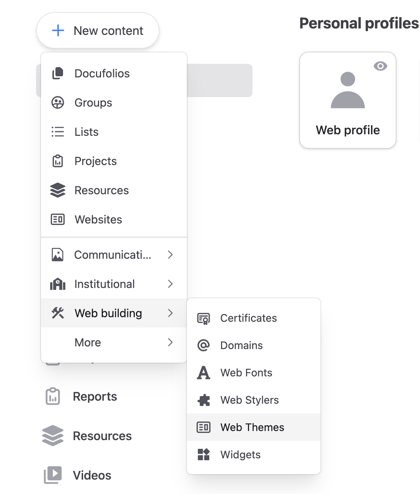
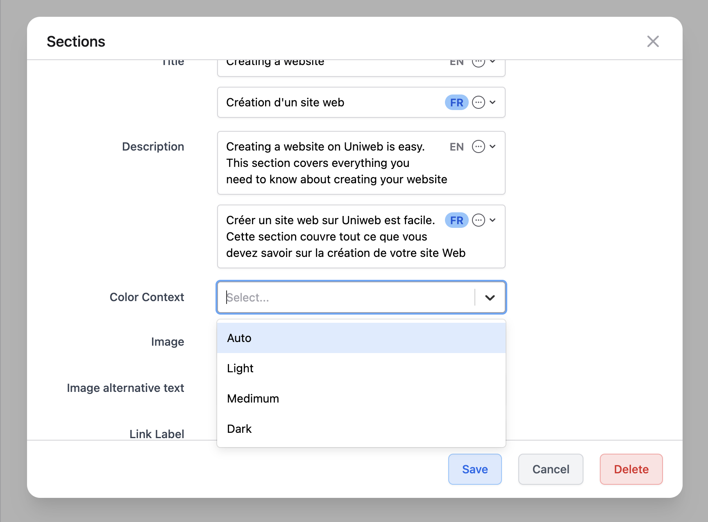
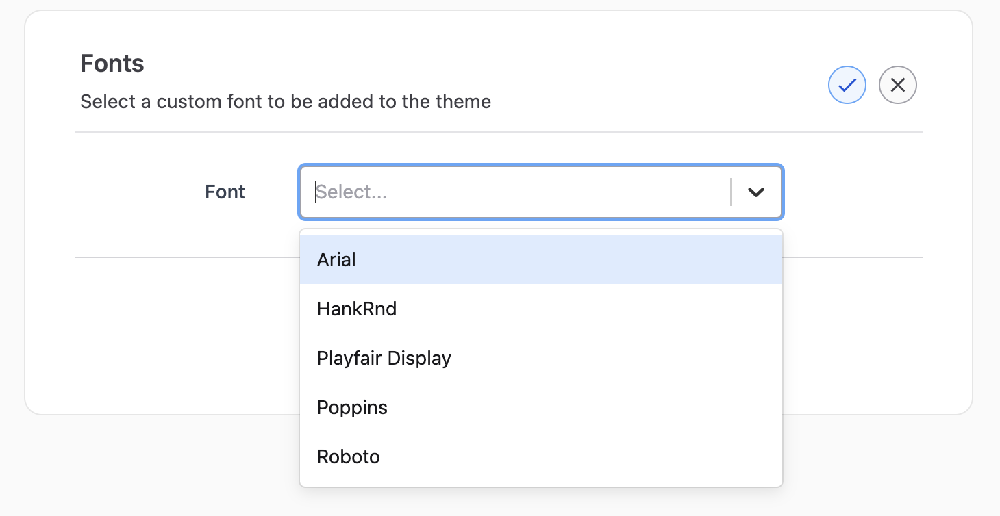
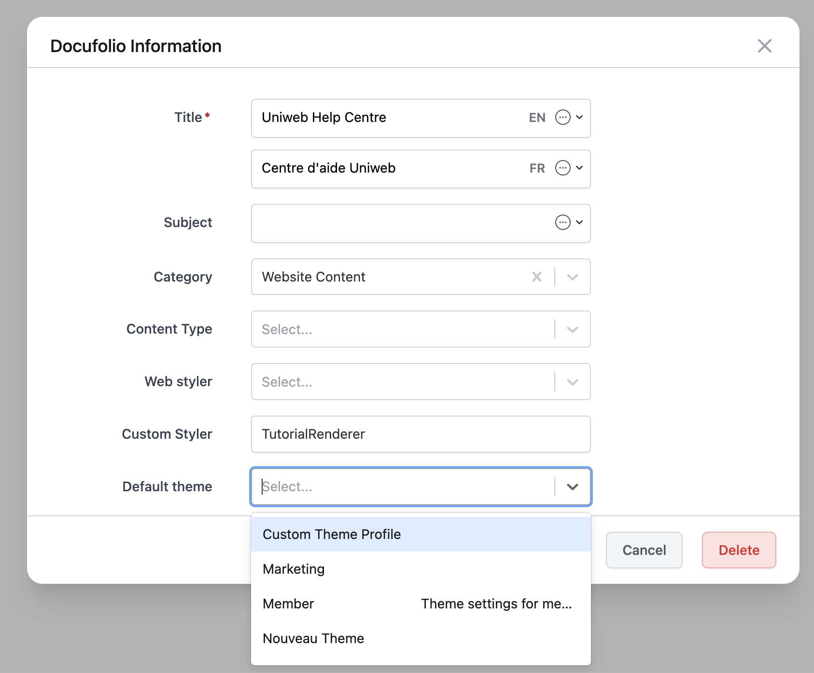
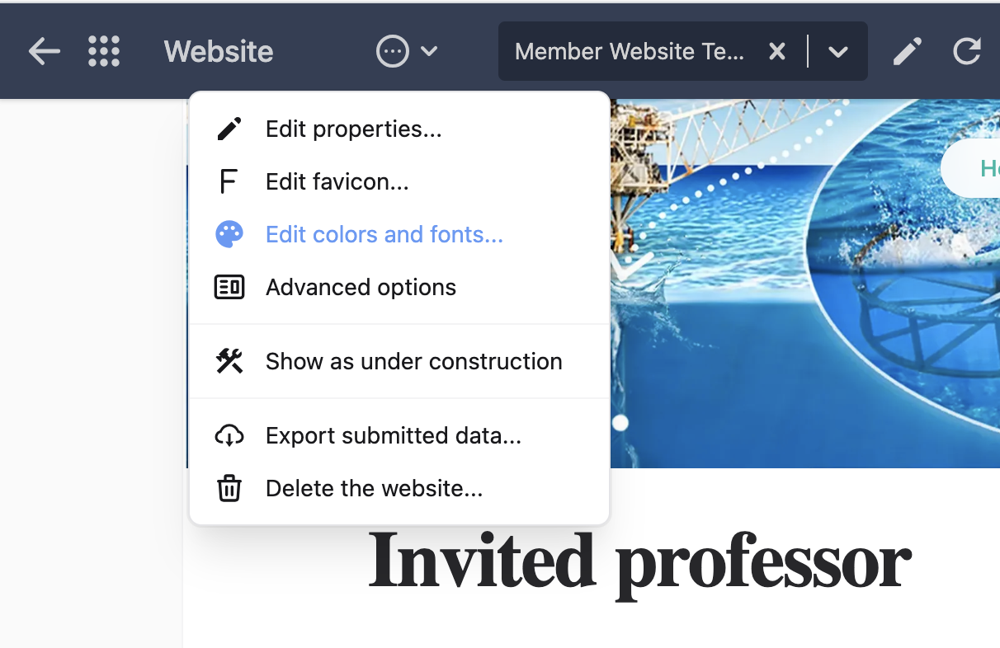
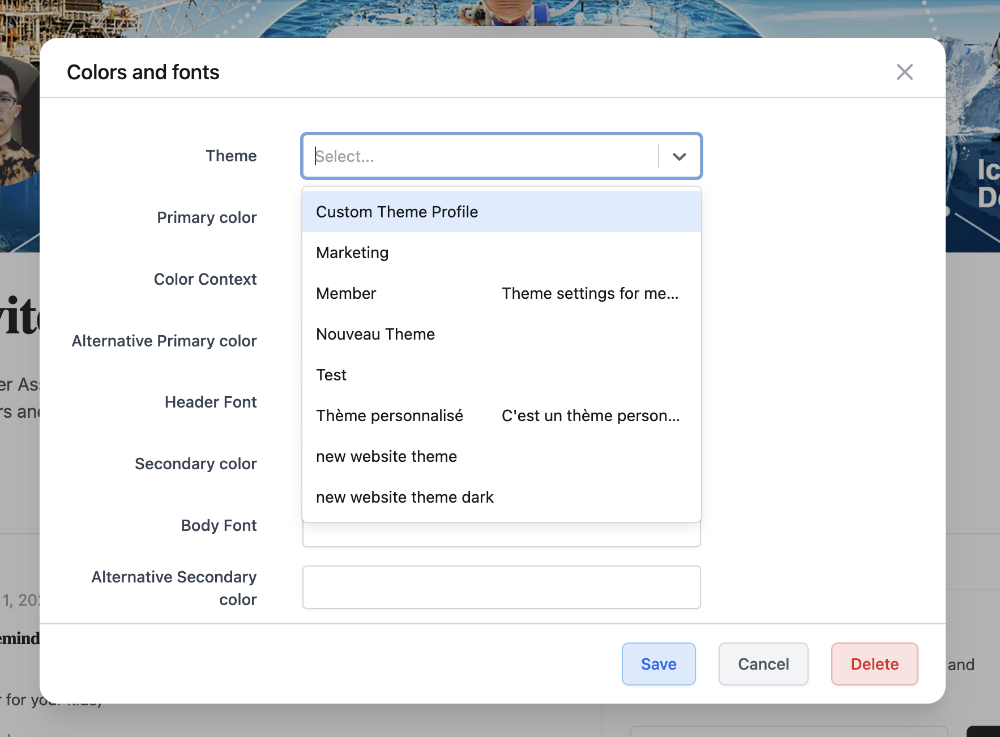

# Customizing the default theme for websites and templates

The Uniweb framework includes a type of profile named `web theme` that is designed to collect information about colors, fonts, spacing, and variables. Web themes can be reused accross multiple websites, providing an effective strategy for consistently managing branding preferences.

A **web theme** is similar to a [Tailwind theme](https://tailwindcss.com/docs/theme) but fulfills a different role. In particular, a web theme is managed by the rendering engine and is not available at compilation time. In contrast, a Tailwind theme is defined in the soruce code of a website module and compiled together with the rest of the module's JavaScript code. 

A website module can define its own Tailwind theme and also benefit from the web theme managed by the engine, which includes run time preferences set by the website project.

## Creating a web theme

The option to create a web theme is under the **Web building** submenu of the **New content** menu of the Uniweb content manager app.

  

The main information of a web theme is:

1. **Theme Name**: The name of the website theme profile.
1. **Theme Description**: The description of the website theme profile.

A web theme profiles has additinal sections that collect information about: `Themes`, `Palettes`, and `Fonts`.

### Themes

1. **Header Font**: The css value of font family which will be applied to heading elements. e.g. "Gill Sans Extrabold", sans-serif
1. **Body Font**: The css value of font family which will be applied to all other elements in the page.

### Palettes

A web theme can define up to 9 palettes, each for a different **target element** and **color context**. Each palette defines colors, spacing, and custom variables. 

Each section of a webpage is associated to exactly one type of palette out of the 9 possible ones. The number 9 comes from the fact that there are 3 types of topics in a [docufolio](docufolio.md) and 3 types of color context that can be set for a page section.

A webpage section is defined by a docufolio section, which in turn belongs to a Topic. There are 3 types of topics: `Header`, `Footer`, and `Regular`. The sections in the header and footer topics appear in every webpage, while the sections in regular topics define the sections of individual webpages.

Each individual docufolio section can be given a color context named `Light`, `Medium`, or `Dark`.



Each palette is defined as follows.

1. **Palette name**: The name of the palette. `Light` | `Medium` | `Dark`.
1. **Target Element**: The target element type which palette styles will be applied to. `Section` | `Page Header` | `Page Footer`.
1. **Colors**: Colors that will be applied to specific html tags.
1. **Paddings**: CSS value of paddings.
1. **Predefined Variables**: Predefined CSS variables. 
6. **Custom Variables**: Define CSS variables with custom names.

The **predefined variables** become CSS variables with the following names:

```json
{
    "Primary color": "--primary",
    "On Primary color": "--on_primary",
    "Secondary color": "--secondary",
    "On Secondary color": "--on_secondary",
    "Accent color": "--accent",
    "On Accent color": "--on_accent",
    "Highlight color": "--highlight"
}
```

### Fonts

Multiple [font profiles](webfonts.md) can be linked into a web theme.

1. **Font**: Select a Font profile. The font profile can define a standard font, a Google font, or provide the needed files for a custom font family.

 

## Linking a web theme to a website

A web theme can be linked to a website in two different and complementary ways.

It can be set as part of a website content or template by selecting the web theme profile as the default theme of a docufolio.

   

It can also be set as the web theme of a website.

1. Click the **Edit colors and fonts** menu
       

2. Select the theme by selecting it from the **Theme** option. Select the default palette in the **Color Context** option. Override the font family of header and body by changing last two fields.
       


## Theming a web component

[Web components](components.md#theming-a-web-component) are designed to use the dynamic web theme provided by a webiste.

## Next step

- [Web fonts](webfonts.md)
